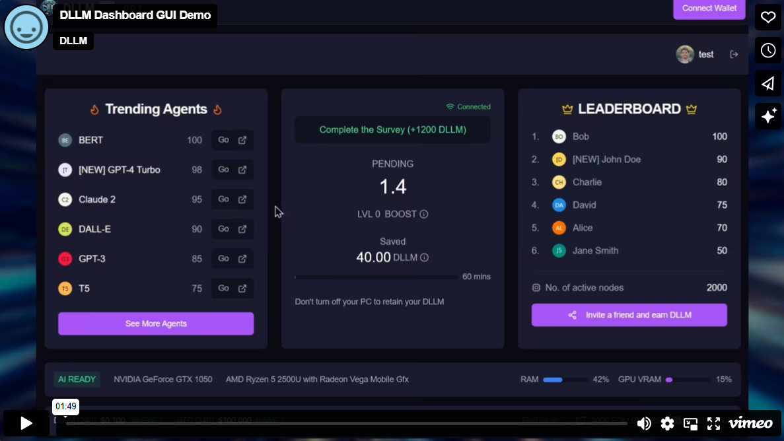

# DLLM Dashboard GUI

DLLM Dashboard GUI for GPU Compute Providers.

## Screenshots

## Download

| Platform | Status | Download |
|----------|--------|----------|
| Windows | ✅ Available |  |
| macOS | 🔜 Coming soon |  |
| Linux | 🔜 Coming soon |  |

## Installation Instructions

### Windows
1. Click the "Download" button above or download "dllmchat-Setup-0.0.1.exe" from our [releases page](https://github.com/dllmchat/DLLM-Dashboard-GUI/releases/tag/0.0.1)
2. Run the downloaded "DLLM Chat Setup" installer
3. The application will install automatically and launch once completed
4. Log in to start using DLLM Chat
